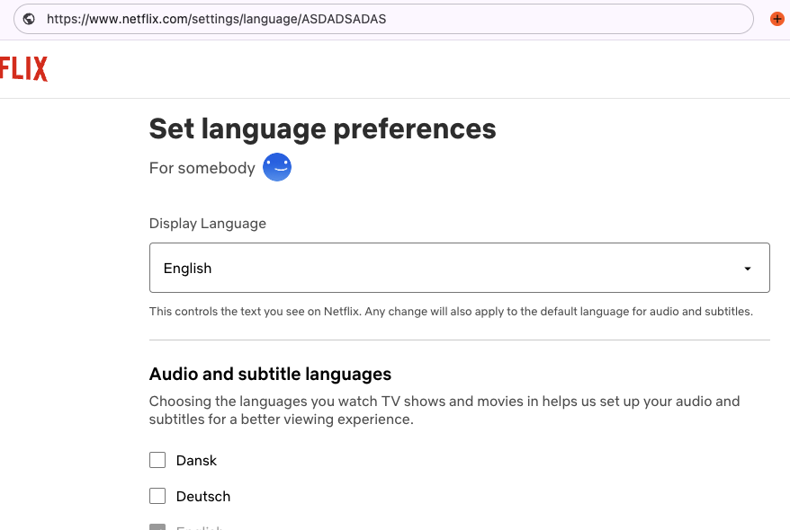
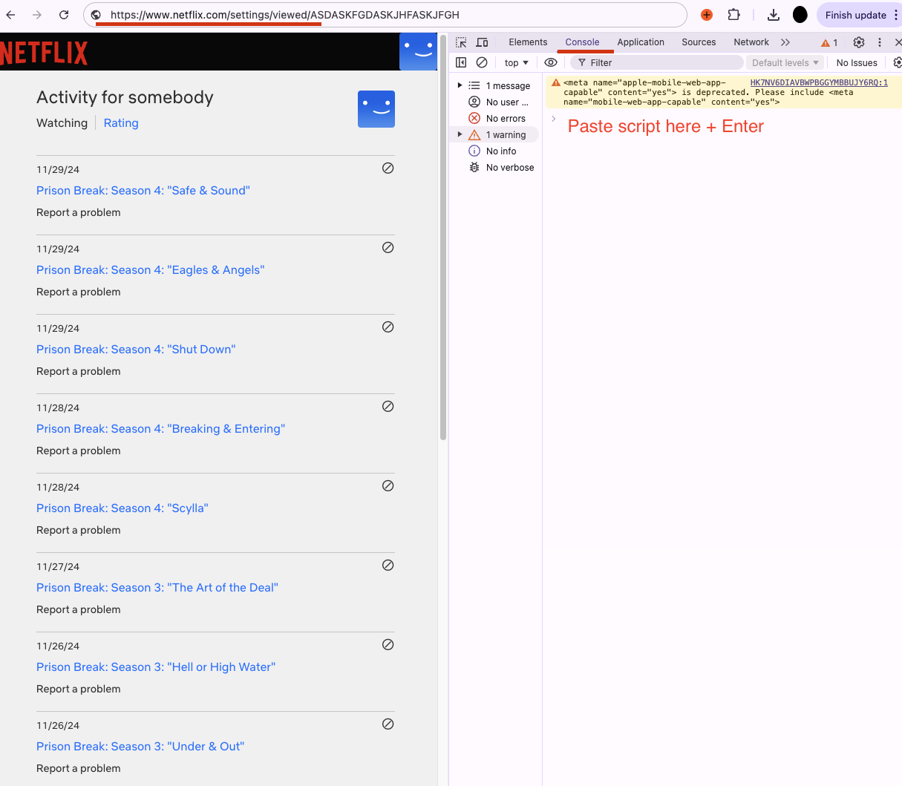

# Netflix Watch History Script

This script analyzes your Netflix viewing history to show you detailed statistics about your watching habits, including total time spent and a visual activity graph.

## Requirements

Netflix account language must be set to English

## How to Use

1. Go to [Netflix Viewing Activity](https://www.netflix.com/settings/viewed)
2. Log in to your Netflix account if needed
3. Open your browser's Developer Tools (usually F12 or right-click -> Inspect)
4. Go to the Console tab in Developer Tools
5. Copy and paste the entire content of `script.js` into the console
6. Press Enter to run the script

> **Note:** You can stop the script at any time by refreshing the page (F5)

## Customizable Settings

You can modify these constants at the top of the script to control its behavior:

- `MAX_ENTRIES`: Set this to a number of titles you want to process, or -1 for ALL entries/episodes/movies you ever watched.
- `HOURLY_RATE`: Set this to a rate you value your time at. for e.g. 45$ per hour.
- `FETCH_DURATION_API_DELAY_MS`: Set this to the delay between API requests. You can speed it up to 100ms (0.1 second) or slow it down to 1000ms (1 second).

## Outputs

The script provides two types of output:

### 1. Browser Display

- A popup window showing:
  - Total watch time statistics
  - Visual contribution graph showing your watching patterns
  - Summary of hours and days watched per year

### 2. Downloaded File

- A text file named `netflix-history.txt` containing:
  - Detailed watch time statistics
  - Money value of time spent (based on hourly rate)
  - Complete contribution graph
  - List of all watched titles with dates and durations

## Notes

- The script needs to be run while you're on the Netflix Viewing Activity page
- It may take some time to process if you have a large viewing history
- The script includes a delay between API calls to avoid overwhelming Netflix's servers

## Disclaimer

This script is provided for personal use only. It accesses publicly available data through your Netflix account but is not officially associated with Netflix. Use at your own risk. We are not responsible for any account-related issues that may arise from using this script. Netflix may change their website structure or API at any time, which could break this script's functionality.
